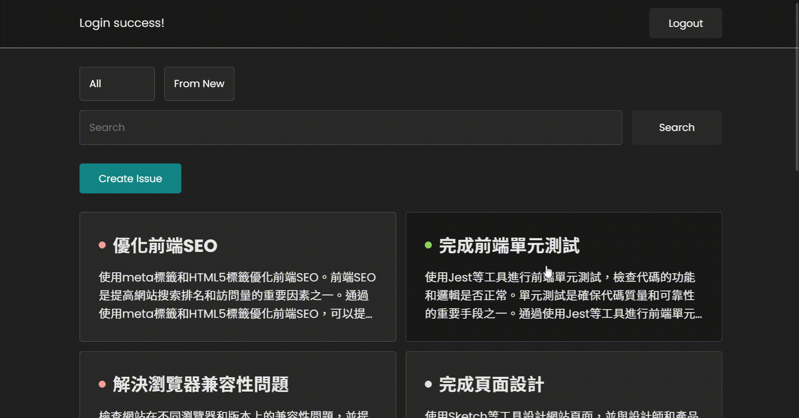
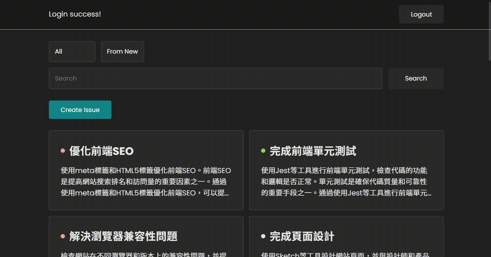

# GitHub Issues API
利用 GitHub OAuth 做第三方登陸，並用 GitHub API 對指定倉庫的 Issues 做增刪改查...等功能


## 啟動
```shell
$ npm install
$ npm run dev
$ cd server
$ node server.js
```

# 使用技術
1. vite + react: 利用 Vite 快速搭建 React + TypeScript 應用程式
2. TypeScript: 使用 TS 增加程式碼的可讀性、可維護性
3. axios: 使用 Axios 發送 HTTP 請求，並處理響應
4. fortawesome: 使用 fortawesome 的 svg 圖標

## 利用 OAuth 做第三方登錄
可用 GitHub 帳號登陸，登陸後即可對 issue 做曾刪改查。除此之外，利用 localStorage 來儲存資料，避免每次進入網站都需要重複登錄。

## Issues API
利用 github issue api 來對 issue 增刪改查，並在前端實現搜尋、分類、排序等功能。

### 搜尋


### 分類、排序


## 新增、修改、刪除


## Lazy loading
使用 Intersection Observer 對 footer 進行觀察，當 footer 進入頁面後抓取下十筆資料，當回傳資料為空陣列後，取消觀察。 

## 前端頁面
沒有使用任何 UI 框架，純粹利用 CSS grid、flex 製作前端頁面，並使用媒體查詢做響應式設計。  
除此之外也修改滾動條、header 背景模糊使其更美觀。  

## 文件結構
```
server
└── server.js
src
├── api
│   └── api.ts
├── components
│   └── Filter.tsx
│   └── Issue.tsx
│   └── IssueCreate.tsx
│   └── IssueModal.tsx
│   └── IssuesList.tsx
│   └── ModalContent.tsx
│   └── ModalFooter.tsx
│   └── modalHeader.tsx
├── context
│   └── IssuesPorvider.tsx
├── css
│   └── Filter.css
│   └── Issue.css
│   └── IssueModal.css
│   └── issuesList.css
│   └── reset.css
├── hook
│   └── useIssuesList.tsx
└── App.tsx
└── index.css
└── index.tsx
└── serviceWorker.ts

```

## 預計實現
1. 優化效能
2. loading 效果，提升用戶體驗